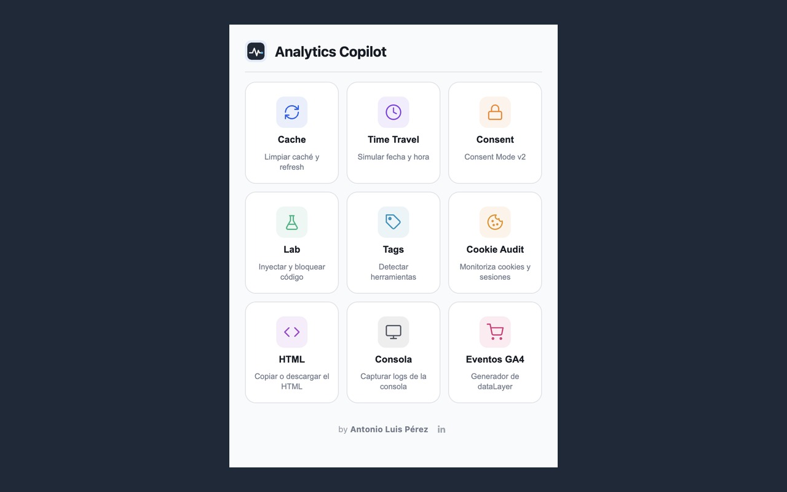
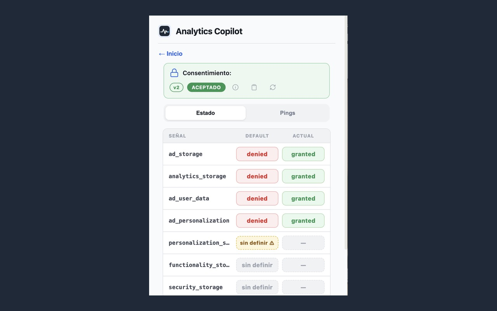
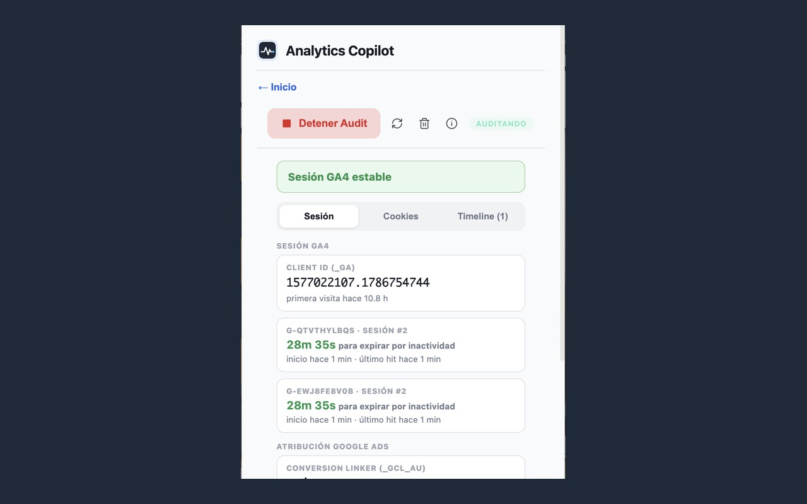

# Analytics Copilot

Extensión de Chrome (Manifest V3) con **9 herramientas para QA de analítica web**: auditar Consent Mode, verificar la atribución de Google Ads de punta a punta, vigilar la sesión de GA4, generar eventos de dataLayer y más. Pensada para quien implementa y depura GA4 / GTM / Google Ads a diario.

Funciona como **popup** en la barra de Chrome y como **panel dentro de DevTools** (pestaña "Analytics Copilot"), con un widget flotante que avisa de las features activas en la página.



## Herramientas

| | Herramienta | Qué hace |
|---|---|---|
| 🏷 | **Tags** | Escanea la página y detecta 40+ herramientas de tracking (GTM, GA4, Meta, TikTok, Hotjar…) con sus IDs, y permite bloquearlas al vuelo |
| 🔒 | **Consent** | Inspector de Consent Mode v2: señales default→update, GCS/GCD decodificados, modo Básico vs Avanzado, hits de Google con su estado de consentimiento al disparo, calculadora GCD, auditoría con 18 reglas y copia de informe |
| 🍪 | **Cookie Audit** | Vigila la sesión GA4 en tiempo real (client_id, countdown de inactividad), la **atribución de Google Ads** (gclid → `_gcl_aw`, Conversion Linker) y las **conversiones** (value, currency, label, enhanced conversions) — ideal para probar clics de anuncio reales |
| 📈 | **Eventos GA4** | Generador de `dataLayer.push()` para el funnel ecommerce completo y eventos recomendados; copia el snippet o púshalo a la página |
| ⏩ | **Time Travel** | Simula otra fecha/hora en el navegador (`Date` override) para probar configuraciones programadas |
| 🔄 | **Cache** | Limpia cookies, storage, cache y service workers del sitio actual y recarga |
| 🧪 | **Lab** | Inyecta un GTM de prueba, hace push al dataLayer (JSON) y bloquea requests por patrón |
| 📄 | **HTML** | Copia o descarga el HTML renderizado (DOM en vivo) de la página |
| 📟 | **Consola** | Captura `console.*` y errores JS de la página (sobrevive a recargas) para copiarlos o descargarlos |

## Instalación (2 minutos)

No está en la Chrome Web Store — se instala en modo desarrollador:

1. **[⬇ Descarga el ZIP de la última versión](https://github.com/alpc-data-analyst/analytics-copilot/releases/latest)** y descomprímelo
2. Abre `chrome://extensions/` y activa el **Modo de desarrollador** (interruptor arriba a la derecha)
3. Pulsa **"Cargar descomprimida"** y selecciona la carpeta descomprimida
4. Fija el icono 📍 en la barra — y si quieres el modo panel, abre DevTools (F12) → pestaña **Analytics Copilot**

> ⚠ No muevas ni borres la carpeta después de instalar: Chrome carga la extensión desde ahí.

## Ejemplo: auditar un clic de anuncio de Google Ads

1. **Cookie Audit → Iniciar Audit** antes de hacer clic en el anuncio
2. Haz clic en el anuncio — el audit se re-ancla al dominio de destino y marca el aterrizaje con su `gclid`
3. Verifica en **Sesión** que el gclid se guardó en `_gcl_aw` ("coincide con la URL ✓") y que el Conversion Linker está activo
4. Completa la compra — la sección **Conversiones** muestra cada objetivo con su value, currency, label, si viajó el gclid y si lleva enhanced conversions

Todo sin abrir la pestaña Network.

| | |
|---|---|
|  |  |

## Permisos y privacidad

- **Todo es local**: la extensión no envía ningún dato a ningún servidor. Solo lee lo que ya ocurre en las páginas que visitas.
- Permisos fijos mínimos (`storage`, `scripting`, `browsingData`, `webNavigation`, `declarativeNetRequest`, `activeTab`).
- Los permisos sensibles son **opcionales y se piden al usarlos**: `cookies` (al iniciar Cookie Audit) y acceso a sitios (`http/https`, al usar cualquier herramienta que inspeccione la página).

## Estructura

```
manifest.json      Manifest V3
background.js      Service worker (motor del Cookie Audit, inyecciones, Lab)
ui/                Popup, panel DevTools, lógica y estilos
content/           Content scripts dinámicos (Time Travel, widget, captura de consola)
icons/             Iconos y fuentes SVG
```

Documentación técnica completa en [ARQUITECTURA.md](ARQUITECTURA.md).
